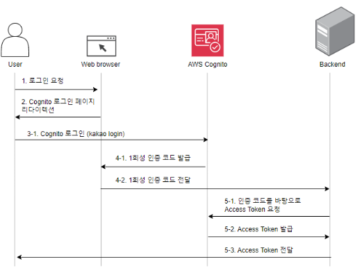
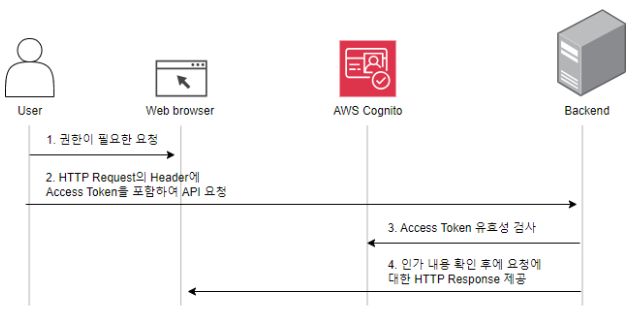

# TukTuk
운동 경기를 하고 싶은 개인들을 매칭하여 경기장을 대여 해주는 플랫폼 서비스의백엔드 레포지토리입니다.

## Spec
Language : Java 17

Freamework : SpringBoot 3.2.1

Build : Gradle 8.5

Database : MySQL

Environment : AWS EKS (Kubernetes)

## API 명세
https://documenter.getpostman.com/view/32243568/2s9YysD2L4

## AWS Congnito와 연계한 인증 및 인가
TukTuk은 사용자를 경기장 소유주, 일반 사용자로 구분합니다. 이에 따라 사용자가 보낸 요청의 토큰을 검증하여 해당 요청을 호출할 수 있는 권한이 있는 지를 확인할 필요가 있습니다.

이를 위해 해당 프로젝트에서는 AWS에서 제공하는 Congnito를 사용하였습니다. 

Congnito를 통해 클라이언트가 서버에 요청을 보내기 전에 액세스 토큰을 발급 받고, 그대로
서버에 전달하여 서버를 전달받도록 구현하여
회원가입 및 로그인 기능을 구현하였습니다.

회원가입이 된 사용자는 로그인하여 Access Token을 발급 받게 됩니다. 그리고 발급받은
Access Token으로 서버에 요청을 보내면 서버는 해당 Token이 유효한 토큰인 지, 해당 Token을 보낸 사용자가 보낸 요청이 인가된 것인 지를 확인하여 사용자 요청을 처리합니다.

## 프로젝트 실행
Docker compose가 작성되어 있고, 이를 실행하는 쉘 스크립트가 작성되어 있으므로 프로젝트의 루트에서 다음과 같이 실행할 수 있습니다.

$ start.sh

p.s 만약 CRLF로 인하여 start.sh 파일이 실행되지 않는다면 아래와 같이 sed 명령을 사용하여 개행을 제거해주시기 바랍니다. 

$ sed -i 's/\r//' start.sh

## 프로젝트 데모
[Demo Video](readme/TukTuk%20Viedo.mp4)

## 기타
[Project Report](readme/TukTuk%20Report.pdf)